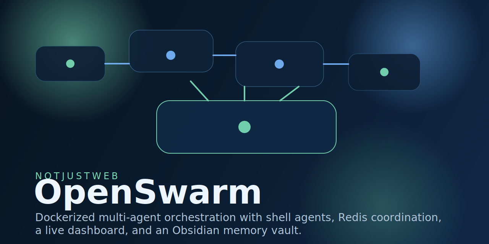
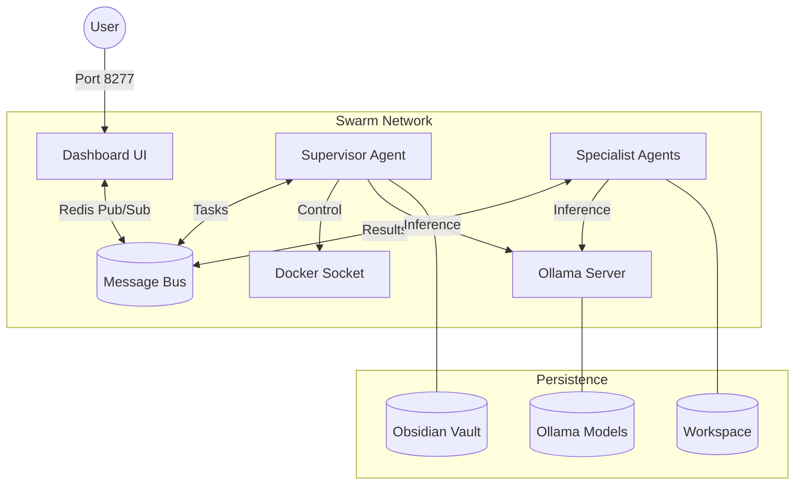
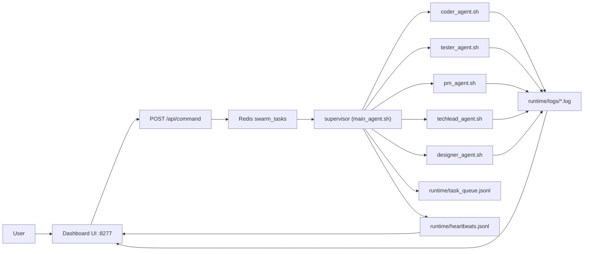
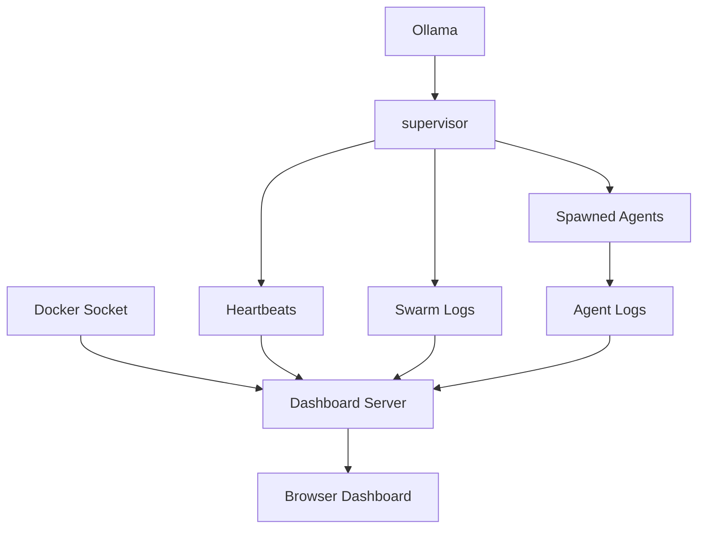

# OpenSwarm

A decoupled, microservices-based multi-agent AI swarm. Orchestrated via Shell, powered by Ollama, and monitored through a live browser dashboard.

## Architecture



## How It Works

### Task Flow



### Monitoring Flow



### Agent Roles

| Agent | Expertise |
| --- | --- |
| `main_agent` | Supervisor, routing, and container orchestration |
| `coder_agent` | Full-stack development and bug fixing |
| `tester_agent` | Quality assurance and verification |
| `pm_agent` | Planning, summaries, and logic framing |
| `techlead_agent` | Technical architecture and review |

## Project Layout

```text
.
├── agents/           # Specialist AI shell scripts
├── config/           # Agent and model configurations
├── dashboard/        # Node.js + Socket.IO control panel
├── obsidian_vault/   # Long-term memory and wiki
├── scripts/          # Lifecycle, bootstrap, and entrypoints
├── shared/           # Redis bus and logging utilities
├── Dockerfile        # Agent/Dashboard base image
├── docker-compose.yml# Microservices orchestration
└── Makefile          # Unified command interface
```

## Features

- **Microservices**: Decoupled Redis, Ollama, Dashboard, and Supervisor containers.
- **Horizontal Scaling**: Use `make scale agent=coder_agent num=3` for parallel processing.
- **Auto-Respawn**: Built-in healthchecks and `restart: always` logic.
- **Token Optimization**: Integrated **Graphify** for code-graph context reduction.
- **Memory Vault**: LLM-maintained Obsidian wiki for long-term project memory.

## Quick Start

```bash
cp .env.example .env
make build
make up
```
Visit [http://localhost:8277](http://localhost:8277).

## Make Targets

| Command | Action |
| --- | --- |
| `make build` | Build all microservice images |
| `make up` | Start the swarm stack |
| `make status` | Check container health |
| `make scale` | Scale agents (e.g., `agent=coder num=3`) |
| `make logs` | Tail supervisor logs |
| `make swarm-deploy`| Deploy to Docker Swarm cluster |
| `make clean` | Wipe containers and volumes |

## Operations

### Creating New Projects

You can scaffold new projects inside the persistent `/workspace/projects` volume:

```bash
make shell # Enter supervisor
/app/scripts/create_project.sh my-new-app
```

### Task Examples

Send tasks to agents via the Dashboard or directly via Redis:

```bash
# Example: Ask coder to build a feature
make shell
/app/shared/bus.sh publish swarm_tasks '{"target":"coder_agent","command":"Add dark mode"}'
```

## Memory Vault

Operational memory is stored in `obsidian_vault/`:

- `raw/`: Immutable source material.
- `wiki/`: LLM-maintained architectural notes.
- `index.md`: Content map.
- `log.md`: Chronological overhaul history.

## Repository Notes

- **Git Friendly**: Logs and temporary states are ignored via `.gitignore`.
- **Recovery**: If the repo is lost, `make recover` can restore the scaffold from the Makefile.
- **Port Visibility**:
  - `8277`: Dashboard UI
  - `11434`: Ollama API
  - `6379`: Redis Bus

## Status

Verified locally: Microservices orchestration, Swarm-ready deployment, and horizontal scaling are fully operational.
