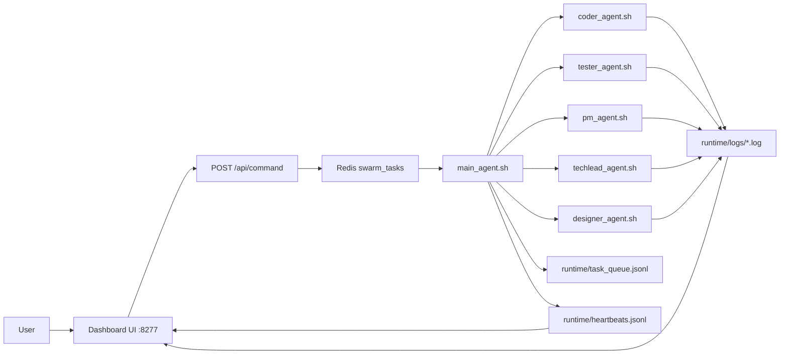
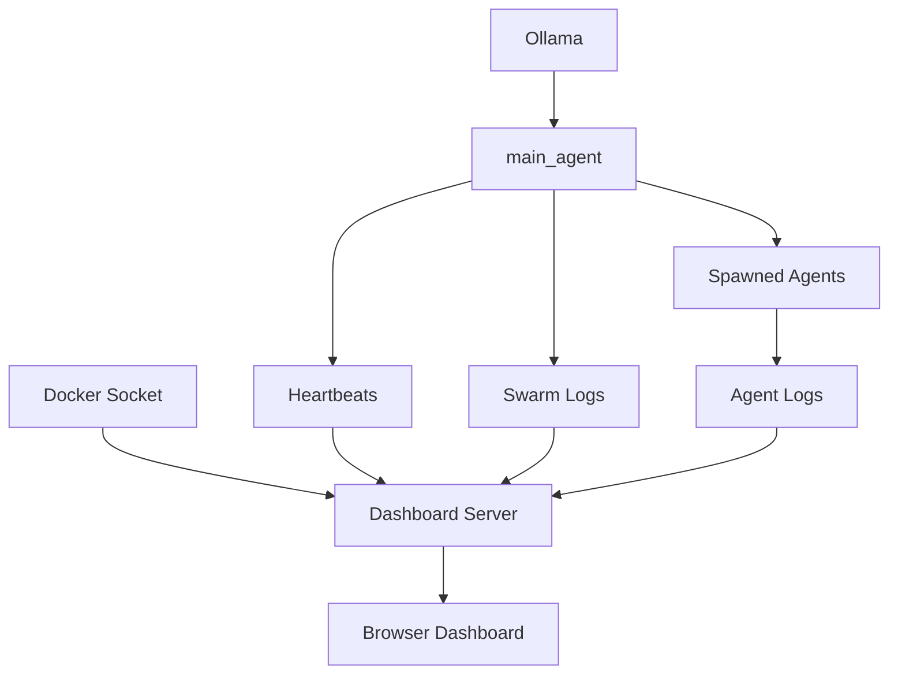

# OpenSwarm

OpenSwarm by NotJustWeb is a Docker-based multi-agent workspace that combines shell-first orchestration, specialist AI workers, a live browser dashboard, Redis messaging, and an Obsidian-style long-term memory vault.

> Build a local AI swarm you can run, steer, monitor, and extend.
> Use it to operate OpenSwarm itself or to create entirely new AI-assisted projects inside the container workspace.

## Why OpenSwarm

- Run a supervisor-driven agent swarm inside a single reproducible Docker setup
- Dispatch work across shell-based specialist agents
- Watch logs, heartbeats, and Docker telemetry from one dashboard
- Keep project memory in a structured wiki-style Obsidian vault
- Recover the scaffold from the `Makefile` alone with `make recover`
- Create new project folders inside the Docker container and have agents build inside them

## What It Includes

- `kimi`-backed supervisor agent running through Ollama
- Specialist shell agents for coding, testing, product, tech lead, and design roles
- Real-time dashboard on port `8277`
- Redis pub/sub message bus for inter-agent coordination
- Persistent Obsidian-compatible knowledge vault for memory and structured notes
- Single-file recovery support through `make recover`

## Architecture

```text
Dashboard (8277)
    -> Redis task channel
    -> main_agent.sh
    -> specialist agents
    -> shared logs + heartbeats
    -> Obsidian memory vault
```

## How The Swarm Works

OpenSwarm follows a supervisor pattern:

1. You send a command from the dashboard or publish a task into Redis.
2. `main_agent.sh` listens on the `swarm_tasks` channel.
3. The supervisor decides which specialist agent should handle the task.
4. The selected agent is spawned as a shell process and works on the request.
5. Logs, heartbeats, and task state are written to shared runtime files.
6. The dashboard reads that state and shows live health, logs, and container info.

### Agent Roles

| Agent | Purpose |
| --- | --- |
| `main_agent` | Supervisor, router, heartbeat emitter, and process watcher |
| `coder_agent` | Code generation and implementation tasks |
| `tester_agent` | QA, dry runs, and verification work |
| `pm_agent` | Summaries, planning, and product framing |
| `techlead_agent` | Architecture and technical review |
| `designer_agent` | UI and UX direction |

### Task Flow



### Monitoring Flow



## Highlights

| Area | Included |
| --- | --- |
| Orchestration | Shell-based supervisor + specialist agents |
| Models | Ollama with `kimi` as the minimum supervisor model |
| Transport | Redis pub/sub message bus |
| UI | Express + Socket.IO dashboard on port `8277` |
| Memory | Obsidian-compatible raw/wiki/schema vault layout |
| Project Workspaces | Persistent `/workspace/projects` area inside the container |
| Recovery | `make recover` restores the scaffold from the `Makefile` |

## Project Layout

```text
.
├── agents/           Shell agents and orchestration roles
├── config/           Agent and model definitions
├── dashboard/        Express + Socket.IO control panel
├── obsidian_vault/   LLM-maintained wiki and raw source memory
├── scripts/          Bootstrap, entrypoint, monitor, and lifecycle helpers
├── shared/           Redis bus, logging, and task queue utilities
├── Dockerfile
├── docker-compose.yml
├── Makefile
└── README.md
```

## Quick Start

```bash
cp .env.example .env
make build
make up
```

Then open [http://localhost:8277](http://localhost:8277).

## Run The Multi-Agent Stack

### Start everything

```bash
make build
make up
```

### Watch the logs

```bash
make logs
```

### Stop the stack

```bash
make down
```

### Rebuild the scaffold from the Makefile only

```bash
make recover
```

## Build New Projects Inside The Container

OpenSwarm is not limited to editing the swarm repo itself. It also supports creating and working on fresh projects inside a persistent container workspace:

- Workspace root inside the container: `/workspace/projects`
- Persistent storage: mounted as a Docker volume
- Best use case: generate a new app, feature branch workspace, prototype, or isolated AI coding project

### Create a new project folder

```bash
docker compose exec openswarm /app/scripts/create_project.sh my-new-app
```

This creates:

```text
/workspace/projects/my-new-app
```

### Open a shell inside the container

```bash
docker compose exec openswarm bash
```

From there you can work directly in:

```bash
cd /workspace/projects/my-new-app
```

### Ask an agent to build inside that workspace

Use the dashboard `Project Path` field or send an API request with `project_path`:

```bash
curl -X POST http://127.0.0.1:8277/api/command \
  -H "Content-Type: application/json" \
  -d '{
    "target": "coder_agent",
    "command": "Create a small FastAPI service with Docker support",
    "project_path": "/workspace/projects/my-new-app"
  }'
```

## How To Give Tasks To Agents

### Option 1: Use the dashboard

1. Open `http://localhost:8277`
2. Pick a target agent
3. Type a command in the Command Center
4. Optionally set `Project Path` to a container workspace folder
4. Submit the instruction
5. Watch heartbeats and logs update in real time

### Option 2: Send a task with curl

```bash
curl -X POST http://127.0.0.1:8277/api/command \
  -H "Content-Type: application/json" \
  -d '{
    "target": "coder_agent",
    "command": "Create a landing page for the dashboard",
    "project_path": "/workspace/projects/demo-dashboard"
  }'
```

### Option 3: Publish directly to Redis

```bash
docker compose exec openswarm /app/shared/bus.sh publish swarm_tasks \
  '{"task_id":"manual-001","target":"tester_agent","payload":{"command":"Run a dry-run verification","project_path":"/workspace/projects/demo-dashboard"}}'
```

## Example Task Patterns

### Ask the coder agent to implement something

```json
{
  "target": "coder_agent",
  "command": "Add a new analytics panel to the dashboard",
  "project_path": "/workspace/projects/demo-dashboard"
}
```

### Ask the tester agent to verify behavior

```json
{
  "target": "tester_agent",
  "command": "Run a dry-run verification for the dashboard task flow"
}
```

### Ask the tech lead agent for architecture help

```json
{
  "target": "techlead_agent",
  "command": "Review the message bus design and suggest improvements"
}
```

## How To Set It Up For Real Work

### Minimum setup

1. Clone the repo
2. Copy `.env.example` to `.env`
3. Build and start the Docker stack
4. Confirm `http://localhost:8277` opens
5. Send a small test task to `tester_agent`
6. Create a new workspace project and send a coding task into it

### Recommended setup

1. Pull the required Ollama model during bootstrap
2. Keep Docker Desktop running so the dashboard can inspect containers
3. Mount the repo into the container with `docker compose`
4. Use `/workspace/projects` for new AI-generated apps or features
5. Use the dashboard as the main operator surface
6. Store durable notes and operational memory in `obsidian_vault/`

### Suggested operator workflow

1. Use `main_agent` as the router, not as the implementation worker
2. Send coding tasks to `coder_agent`
3. Send checks and validation to `tester_agent`
4. Use `pm_agent` and `techlead_agent` when you want structured planning or architecture input
5. Review the dashboard log stream after every important task

## What You See In The UI

The dashboard is designed as a lightweight command center:

- `Steering` lets you choose an agent and send instructions
- `Project Path` lets you target a new or existing workspace folder inside the container
- `Docker` shows container state and system visibility through Docker socket access
- `Heartbeats` shows whether the supervisor is alive and updating on schedule
- `Live Logs` shows the shared swarm log stream

This means you can treat the UI as both:

- an operator console for sending work
- a monitoring screen for watching the swarm respond

## Make Targets

- `make build` builds the Docker image
- `make up` starts the OpenSwarm stack
- `make logs` tails container logs
- `make down` stops the stack
- `make clean` removes containers and volumes
- `make recover` restores the scaffold from the embedded payload inside `Makefile`

## Memory Vault

The `obsidian_vault/` folder follows the wiki-maintainer pattern:

- `raw/` stores immutable source material
- `wiki/` stores LLM-maintained pages
- `index.md` is the content map
- `log.md` is the append-only history
- `AGENTS.md` defines the vault workflow and editing rules

## Public Repo Notes

- This repository is designed to be Git-friendly and easy to clone, run, and extend
- Runtime logs, temp state, env files, and local dependency folders are ignored from Git
- The dashboard, agent scripts, Docker setup, and memory vault live together in one repo

## Notes

- The container starts Redis, Ollama, the dashboard, and then the supervisor agent.
- The dashboard reads Docker state through `/var/run/docker.sock`.
- Some tool onboarding commands are best-effort so the stack stays bootable.
- Runtime logs and state are intentionally ignored from Git.

## Status

The scaffold, Docker image build, dashboard boot, and end-to-end task routing have been verified locally in this workspace.
